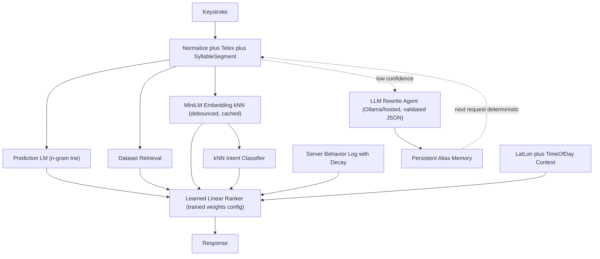

# Real-AI Generalization Plan

## Guiding constraints

- Keep the SPEC latency budget (p95 <= 150 ms) and clean degradation: every new AI component falls back to the current deterministic path.
- The 60 public eval cases become a **held-out test set only** — stop using them as a source of templates or training labels.
- No paid services required: embeddings via local model, LLM via optional Ollama/hosted key.

## Phase 0 — Credibility fixes (small, do first)

Bugs that would embarrass the project in a judge review, all quick:

- Fix live-source mislabel in [src/lib/frontendSuggest.ts](src/lib/frontendSuggest.ts) (`place.source === 'live'` never matches client's `'tasco-api'`).
- Fix empty live route reported as `source: 'live'` in [src/lib/tascoFacade.ts](src/lib/tascoFacade.ts); log swallowed upstream errors and expose a `degraded` flag in `meta`.
- Stop showing fabricated `scoreFactors` constants in the UI path (`frontendSuggest.ts` lines ~150–160); pass through real engine factors.
- Delete or wire `src/lib/moduleContracts.ts` (currently dead code cited in TEST_MATRIX).
- Refresh stale metrics in [docs/TEST_MATRIX.md](docs/TEST_MATRIX.md).

## Phase 1 — Fix retrieval generality (kills the zero-result failures)

- Apply the existing Vietnamese syllable segmenter ([src/lib/vietnamese.ts](src/lib/vietnamese.ts)) in the **main** `understandQuery` path in [src/lib/engine.ts](src/lib/engine.ts), not only behind the agentic trigger — `ksd`, `coffeenear`, `nguyenhuee`, `dhbk` must retrieve without agentic mode.
- Verify with `npm run eval:robust`: target 100% top-3 on compact perturbations, no zero-result cases.

## Phase 2 — Real embeddings + learned intent (biggest "actually AI" upgrade)

- Add a build-time script that embeds the corpus (POIs, autocomplete pairs, popular queries, generated patterns) with a real multilingual model via `@huggingface/transformers` (e.g. `paraphrase-multilingual-MiniLM-L12-v2`), writing vectors to a JSON artifact.
- Runtime: embed only the query (debounced, cached per prefix), cosine kNN against precomputed vectors. Keep the current trigram similarity in [src/lib/semantic.ts](src/lib/semantic.ts) as the no-model fallback — same interface, honest naming (`provider: 'minilm' | 'lexical-fallback'`).
- Replace the rule-vote intent classifier with **kNN intent voting over embedded labeled queries** (autocomplete + popular queries carry intent labels), keeping the hard overrides (coordinate, navigation). Target: intent accuracy from 68.3% to >= 80%, Discovery Search from 41.2% to >= 60%.
- Shrink `SEMANTIC_TEMPLATES` (~87 entries): keep only entries the embedding path cannot recover; measure with eval before/after each removal batch.

## Phase 3 — True query prediction (generation, not just retrieval)

- Build a **prefix-completion language model** trained at build time from dataset text (query corpus: autocomplete pairs, popular queries, POI names, generated patterns): a token/syllable-level n-gram model with a trie for beam completion. This generates likely full queries for unseen prefixes instead of only matching stored strings.
- Add it as candidate source `source: 'predicted'` feeding the existing ranker; entirely deterministic, microseconds at this corpus size, and it demonstrably completes prefixes that appear in no dataset row.

## Phase 4 — Deploy the learned ranker properly

- Fix the training data: generate labeled pairs from the **robustness perturbation set** (192 cases) plus recorded behavior selections, not the raw 60 eval cases; hold eval out as the test set.
- Replace coordinate search in [src/lib/learningToRank.ts](src/lib/learningToRank.ts) with pairwise logistic regression over the 8 existing `ScoreFactors` (stays a transparent linear model, satisfies US-008 explainability).
- Ship the result: `npm run rank:train` writes `config/ranking-weights.json`; engine loads it as the default instead of `DEFAULT_RANKING_WEIGHTS` (env/flag to revert). Report train/test metrics honestly in the README.

## Phase 5 — Personalization from actual behavior

- Move behavior events server-side: POST selections to the API, store per `userId` in a local JSON/SQLite log (hackathon-safe, disposable per SPEC).
- Add recency decay (exponential over days) and frequency weighting in `behaviorBoost` in [src/lib/engine.ts](src/lib/engine.ts); accept `behaviorEvents`/`userId` through [src/lib/suggestApi.ts](src/lib/suggestApi.ts) and the facade path so server ranking sees them.
- Unify the duplicated boost logic (`applyBehaviorContext` in `frontendSuggest.ts` vs `behaviorBoost` in engine) into one module. Keep simulated profiles as demo presets only, labeled as such.

## Phase 6 — Context awareness beyond city

- Use `lat`/`lon` in the engine: haversine distance to POIs as a real `locality` factor (closer = higher), city inference from coordinates when `city` absent.
- Add time-of-day context: boost `mở cửa khuya`/`ăn đêm`/24-7 candidates at night, breakfast phở in the morning — grounded in the existing enrichment opening-hours data.

## Phase 7 — Make the agentic layer real

- Wire [src/lib/rewriteProvider.ts](src/lib/rewriteProvider.ts) into `resolveAgenticCorrection` in [src/lib/agentic.ts](src/lib/agentic.ts) as the `hosted-mini`/`local-hermes` provider (Ollama endpoint or hosted key via env), keeping the existing JSON schema validation and guardrails. Fixture list becomes last-resort fallback.
- Load persistent alias memory (`data/alias-memory.local.json`) at server startup in [scripts/api.ts](scripts/api.ts) and pass it into `suggest()` — accepted LLM rewrites then become deterministic on repeat queries (the self-improvement story, now actually running).
- Remove `agentic: false` hardcode in [src/lib/tascoFacade.ts](src/lib/tascoFacade.ts) so the integrated path benefits too.

## Verification gates

- After each phase: `npm run check` (tests, eval, smoke, build) plus `npm run eval:robust`.
- Success criteria: eval top-1 >= 90% maintained with templates shrunk; robustness compact top-3 = 100%; intent >= 80%; p95 latency <= 100 ms with embeddings on; all AI components off → current deterministic behavior preserved.

## Architecture after the plan

## Suggested order if time-boxed

Phases 0–2 are the highest value per hour (credibility + robustness + real model). Phase 7 is the best "agentic AI" demo story. Phases 3–6 deepen the technical narrative; each is independently shippable.

Implementation note, 2026-07-04: Phase 0, Phase 2, and Phase 7 are complete. `npm run embeddings:build` now produces a 316-document, 384-dimension MiniLM artifact using `Xenova/paraphrase-multilingual-MiniLM-L12-v2`; the runtime async server path is measured by `npm run eval:minilm` with MiniLM on all 60 cases, no degraded cases, top-1 96.7%, top-3/top-5 100%, intent 98.3%, MRR 0.983, and p95 28 ms after the cold model-load outlier. Sync `npm run eval` remains 96.7% top-1 and 98.3% intent. kNN intent voting is integrated and measured in the async path while coordinate/navigation/direct-evidence safeguards remain for deterministic fallback quality. `SEMANTIC_TEMPLATES` was pruned from the prior broad set to 83 rendered templates with eval guards. Phase 7 writes accepted hosted/local rewrite observations back through the server runtime hook so `data/alias-memory.local.json` and the in-memory alias set are updated without restart.

Implementation note, 2026-07-05: Phase 1 is complete. Compact alias/abbreviation token splitting now rewrites `ksd`, `coffeenear`, `nguyenhuee`, `12nguyenhueq`, and `dhbk` through the main deterministic `understandQuery` path while preserving negative compact fallback such as `capherang`. `npm run eval:robust` now reports 192 cases, 100% top-3/top-5 recall, compact 53/53 top-3, no top-3 misses, and p95 28 ms. `npm run check` passes with 17 test files, 106 tests, public eval top-1 96.7%, top-3/top-5 100%, intent 98.3%, API smoke, and production build.

Engineering cleanup:
- `suggest()` and `suggestAsync()` duplicate most of the pipeline and should be unified before more ranking/rewrite work.

To-do Lists:
[x] Fix facade/frontend bugs: live-source mislabel, empty-route 'live', fabricated score factors, dead moduleContracts, stale TEST_MATRIX metrics

[x] Apply syllable segmentation in main retrieval path; verify robustness compact cases hit 100% top-3

[x] Build-time corpus embedding with multilingual MiniLM (transformers.js), runtime query kNN with lexical fallback

[x] Replace rule-vote intent classifier with embedding kNN voting; shrink SEMANTIC_TEMPLATES with eval guard

[ ] Add n-gram/trie prefix-completion language model as a 'predicted' candidate source

[ ] Retrain ranker on perturbation+behavior data with pairwise logistic regression; load learned weights at runtime from config

[ ] Server-side behavior event log with recency decay; accept events through API and facade; unify duplicate boost logic

[ ] Use lat/lon haversine distance in locality factor and time-of-day boosts from enrichment hours

[x] Wire real LLM provider into agentic rewrite path, load persistent alias memory at server startup, remove facade agentic:false hardcode

[x] Run npm run check and robustness eval after each phase; confirm success criteria and fallback behavior
