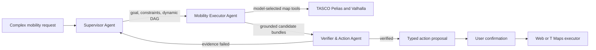

# Tasco Whisperer: Real Three-Agent Mobility System

## What changed

The previous implementation displayed seven role names, but most of those
roles were fixed TypeScript functions. A hosted model could optionally produce
intent JSON and a plan, while the actual place-search, route-comparison, and
verification order was hard-coded.

The current implementation has exactly three autonomous agents. Each agent is a
separate OpenRouter model run with its own instructions, tools, termination
rules, telemetry, and responsibility boundary. The production runtime does not
pretend that deterministic code is an agent when the model is unavailable.

Ordinary autocomplete remains a separate low-latency path and never waits for
these agents.

## Architecture



Every call appears in `AgentTaskSnapshot.modelCalls`. Every tool execution
appears in `AgentTaskSnapshot.toolCalls`. The browser renders both ledgers and
the SSE event trace.

## Agent 1: Supervisor Agent

The Supervisor owns understanding and planning, not map facts.

Inputs:

- the natural-language query;
- current location, destination, time, locale, and vehicle context;
- a deterministic grounded draft containing only coordinates and facts already
  available from the request or known-location dataset;
- verifier failure evidence when replanning.

Its terminal tool is `submitPlan`. The model must call this tool with:

- a structured `AgentGoal`;
- hard, soft, or missing constraints;
- an acyclic task-specific execution plan;
- concise decision rationale;
- a clarification question when required route context is missing.

The tool input is validated with Zod. The runtime then validates unique step
IDs, dependency references, and acyclicity again. The Supervisor cannot call
map services or invent results. On a replan, it receives the actual verifier
failure and produces a new plan version without silently relaxing a hard
constraint.

## Agent 2: Mobility Executor Agent

The Executor is a genuine reasoning-and-action loop implemented with the AI SDK
`ToolLoopAgent`. It receives the Supervisor plan, but chooses which tools to
call, their order, candidate IDs, route-corridor width, and when enough evidence
has been collected.

Its allowlisted tools are:

| Agent tool | Runtime capability |
|---|---|
| `resolveLocations` | Resolve origin and destination only from validated context. |
| `calculateBaselineRoute` | Call live Valhalla first, otherwise return a labeled local estimate. |
| `searchAlongRoute` | Call live Pelias, merge allowed fallback evidence, and spatially filter the route corridor. |
| `compareDetours` | Calculate waypoint routes and compare them with the baseline. |
| `checkOpeningStatus` | Return source-backed open status or explicitly return unverified. |
| `findNearbyPlaces` | Attach grounded amenities near known candidate IDs. |
| `readPreferences` | Read a scoped preference summary; never bypass hard constraints. |
| `submitEvidence` | Terminal tool that submits known candidate IDs to verification. |

The model never sends raw HTTP. Tool adapters own URL construction, timeouts,
normalization, provenance, and fallback. Unknown candidate IDs produce no
evidence. The loop stops after `submitEvidence` or its bounded step limit.

The runtime maintains a private evidence workspace containing resolved
locations, baseline route, returned POIs, waypoint comparisons, opening
statuses, nearby amenities, and preference summaries. Candidate bundles can be
built only from this workspace, preventing model-authored POIs or distances.

## Agent 3: Verifier & Action Agent

Verification is a separate model run so the agent that collected evidence does
not approve its own uninspected summary.

The Verifier can call:

- `inspectCandidate` to retrieve a full grounded bundle;
- `approveCandidate` after every hard constraint passes;
- `requestReplan` when a different safe strategy may succeed;
- `noSafeResult` when the request cannot be satisfied safely.

Approval is checked again by deterministic policy code. A candidate cannot be
approved if it is ineligible, exceeds the detour limit, has the wrong category,
or has unverified opening hours for a hard `open now` constraint. Soft
preferences affect score only after these checks pass.

Successful approval creates a typed `add_stop` proposal. It does not execute
navigation. The action has an expiry, is replay-protected, and stays locked
until the user calls the confirmation endpoint. The client later reports
execution success or failure.

The production Verifier loop enforces two phases rather than relying on prompt
wording alone. When candidates exist, its first model step can call only
`inspectCandidate`. Its next step must call exactly one of the three terminal
decision tools. A prose-only response therefore cannot silently end the task.
`inspectCandidate` returns a compact evidence projection and deliberately
omits full route geometry, preventing long Valhalla coordinate arrays from
exhausting the model context window.

## Prompts and recoverable model failures

All three system prompts are intentionally kept together in
`src/lib/mobilityAgentPrompts.ts`. The provider imports those constants in
`src/lib/mobilityReasoningProvider.ts`, where each prompt is paired with its
own tools, schemas, and loop-control policy.

The Supervisor and Verifier each receive at most one retry when a model or
provider call fails in a recoverable way, including a missing terminal tool
decision. Every attempt is recorded separately in `modelCalls`, and the retry
appears in the SSE event trace. A retry does not consume the replan budget:
replanning remains a deliberate Verifier decision based on candidate evidence.
The Executor is not retried automatically because repeating it could duplicate
external routing and place-search tool calls.

## Hero query execution

For:

> Find an EV charger on my route to Đà Nẵng, near coffee, open now, with less
> than a 10-minute detour.

the expected autonomous flow is:

1. The Supervisor identifies charger, open-now, and detour constraints and
   classifies nearby coffee as a preference.
2. It submits a dependency-aware plan.
3. The Executor resolves route endpoints and requests the baseline route.
4. It searches for chargers along the route corridor.
5. It compares waypoint detours and checks source-backed opening status.
6. It may search for nearby coffee and read scoped preferences.
7. It submits only candidate IDs returned by tools.
8. The Verifier inspects candidate bundles.
9. If all candidates fail, it calls `requestReplan` with evidence.
10. The Supervisor produces plan version 2 and the Executor runs a revised
    strategy.
11. The Verifier approves one candidate only after all hard constraints pass.
12. The runtime creates an `add_stop` proposal and waits for confirmation.
13. Only after confirmation may the web or future T Maps executor update the
    route.

The number of OpenRouter requests is not fixed at three. Each `ToolLoopAgent`
may require multiple model steps because tool results are returned to the model
before it chooses the next action. A replan adds another Supervisor, Executor,
and Verifier run. The model-call ledger exposes the exact count.

## Live services and fallback truth

The default server configuration calls TASCO's public gateways:

- Pelias: `https://tasco-maps.dnpwater.vn/geocode`
- Valhalla: `https://tasco-maps.dnpwater.vn/route/route`

If a map service times out, fails, or returns no usable result, an allowlisted
tool may use the separate local mobility dataset or a waypoint estimate. Those
facts are labeled `synthetic-demo` or `derived-estimate`. Map fallback is not a
replacement for agent reasoning.

If the OpenRouter key or model is missing, a production agent task fails with a
configuration message. There is no production deterministic planner disguised
as a multi-agent system. Unit tests and API smoke use an explicitly named
`scripted-test-provider` only to validate orchestration without external cost.

## API

- `POST /v1/agent/tasks`
- `GET /v1/agent/tasks/{taskId}`
- `GET /v1/agent/tasks/{taskId}/events`
- `POST /v1/agent/tasks/{taskId}/clarifications`
- `POST /v1/agent/tasks/{taskId}/actions/{actionId}/confirm`
- `POST /v1/agent/tasks/{taskId}/actions/{actionId}/result`
- `POST /v1/agent/tasks/{taskId}/cancel`

The task state carries the goal, constraints, plan versions, separate model
calls, tool calls, evidence bundles, verification report, and typed action.

## Safety boundaries

- The model can invoke only schema-validated tools.
- The model cannot make raw network requests.
- POI content is treated as data, never instructions.
- Hard constraints cannot be silently relaxed.
- Unverified hours cannot satisfy `open now`.
- Plans must be acyclic.
- Tool and replan budgets are enforced by runtime code.
- Unknown candidate IDs cannot become recommendations.
- Navigation changes require explicit confirmation.
- Cancelled, expired, and replayed actions are rejected.
- Prompts request concise rationale, not private chain-of-thought.

## Configuration

Copy `.env.example` to `.env` and set:

```dotenv
TASCO_MOBILITY_AGENT_ENDPOINT=https://openrouter.ai/api/v1
TASCO_MOBILITY_AGENT_MODEL=openai/gpt-4o-mini
TASCO_MOBILITY_AGENT_API_KEY=sk-or-v1-your-key
```

`npm run demo` and `npm run api:dev` load `.env` automatically. The key remains
server-side and is never exposed through a `VITE_*` variable.
